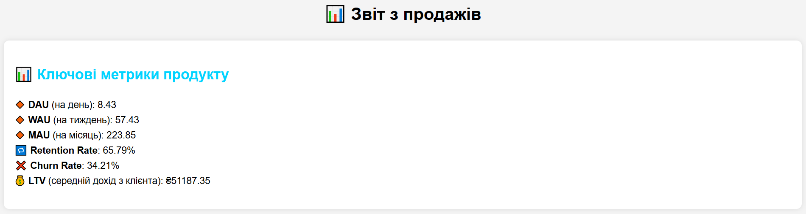
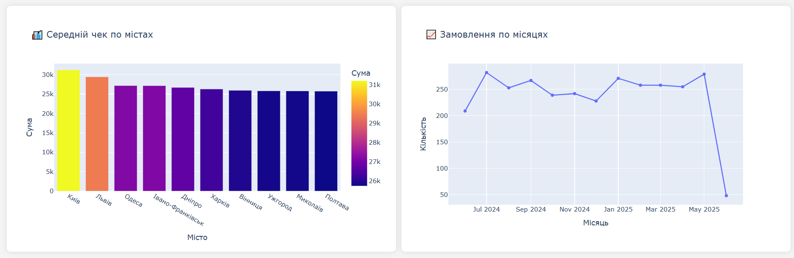
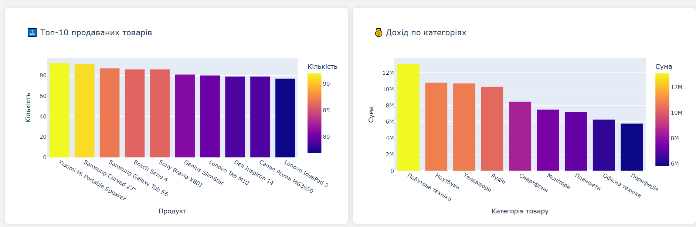
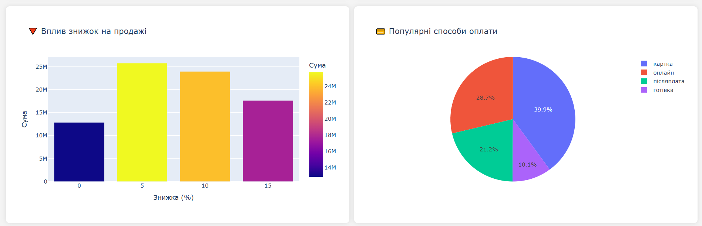
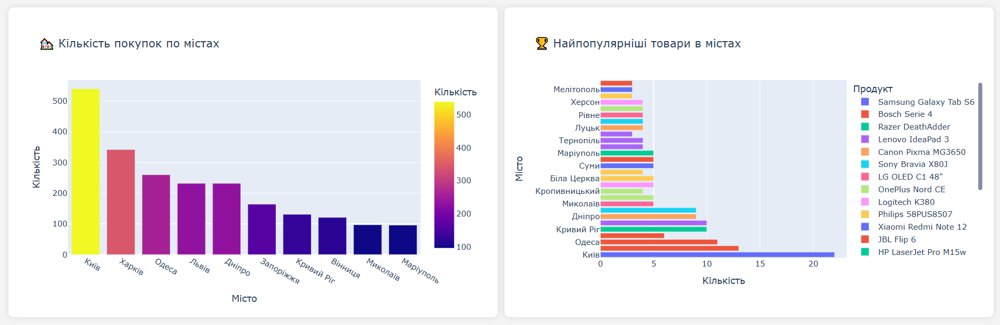

# 📊 Проєкт: Аналіз Продажів + Візуалізація

Цей проєкт демонструє повний цикл роботи Data Analyst: від генерації даних до побудови інтерактивних графіків. Дані про замовлення були згенеровані з урахуванням реалістичних параметрів (місто, зарплатня, знижки), а потім використані для аналітики та створення дашборду.

---

## 📁 Структура проєкту

- `generate_data.py` — генерація синтетичних даних для понад 8000 користувачів і замовлень (враховує рівень зарплатні, місто, категорії товарів).
- `detailed_sales_data.xlsx` — підготовлені дані з усіма атрибутами замовлень.
- `analytics.py` — обробка Excel-даних, розрахунок ключових метрик (DAU, WAU, MAU, Retention, LTV), створення 8 інтерактивних графіків.
- `all_graphs.html` — фінальний дашборд зі всіма візуалізаціями у вигляді HTML-файлу.

---

## 🧮 Метрики, що розраховуються

- DAU / WAU / MAU
- Retention Rate
- Churn Rate
- Lifetime Value (LTV)

---

## 📈 Візуалізації (Plotly)

- Топ-10 продаваних товарів
- Дохід по категоріях
- Середній чек по містах
- Динаміка замовлень по місяцях
- Вплив знижок на суму продажів
- Популярність способів оплати
- Кількість покупок по містах
- Найпопулярніші товари в різних містах

---

## 🛠 Використані технології

- Python 3
- Pandas
- Plotly Express
- Faker (для генерації реалістичних даних)
- Excel (як формат вхідних/вихідних даних)

---
## 🔍 Приклад дашборду







---
## ✅ Як запустити

1. Встановіть залежності (за потреби):

```bash
pip install pandas plotly faker openpyxl
